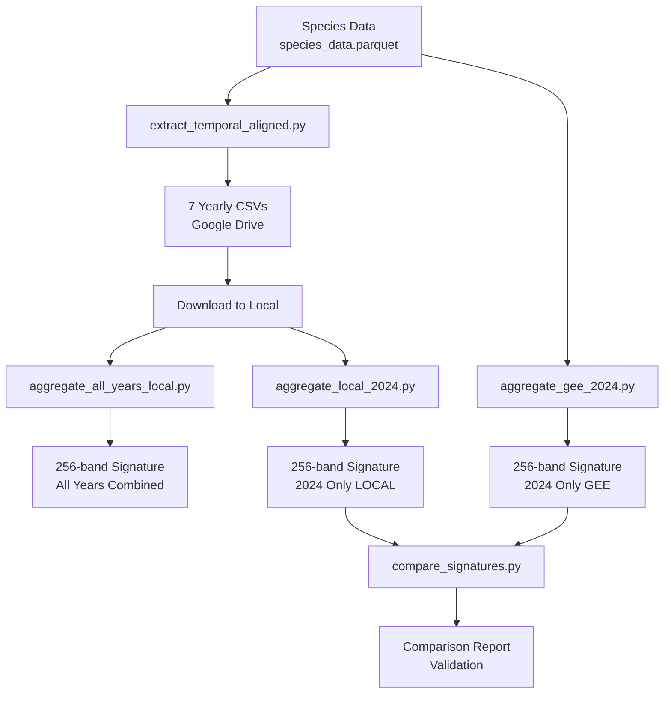

# GEE Temporal Extraction Project - Complete Summary

## 🎯 Project Goal

Extract 256-band signature embeddings for species (Quercus coccifera) using Google Earth Engine Alpha Earth satellite data (2018-2024).

**Final Output:** 64 bands × 4 statistics (mean, std, p10, p90) = **256-dimensional feature vector** per species.

---

## ✅ What We Accomplished

### 1. ✅ Yearly Data Extraction (GEE Server-Side)
**Script:** `extract_temporal_aligned.py`

**What it does:**
- Loads species occurrence data (lat/lon points)
- Samples Alpha Earth imagery for each year (2018-2024)
- Exports **7 CSV files** (one per year) with 64-band embeddings
- Each CSV: ~4,885 rows × 67 columns

**Output Location:** Google Drive → `species_yearly_embeddings/`

**Key Features:**
- ✅ Filters points to land only (removes ocean points)
- ✅ Uses 250m resolution (Alpha Earth native)
- ✅ Filters tiles by bounding box (efficient)
- ✅ Preserves geometries for sampling
- ✅ Exports directly to Google Drive

**Files Created:**
```
Quercus_coccifera_year_2018_embeddings_64d.csv
Quercus_coccifera_year_2019_embeddings_64d.csv
Quercus_coccifera_year_2020_embeddings_64d.csv
Quercus_coccifera_year_2021_embeddings_64d.csv
Quercus_coccifera_year_2022_embeddings_64d.csv
Quercus_coccifera_year_2023_embeddings_64d.csv
Quercus_coccifera_year_2024_embeddings_64d.csv
```

---

### 2. ✅ Local Aggregation (Single Year)
**Script:** `aggregate_local_2024.py`

**What it does:**
- Reads 2024 yearly CSV
- Computes mean, std, p10, p90 for each of 64 bands
- Creates 256-band signature locally (pandas/numpy)
- Saves for upload to Google Drive

**Output:** `Quercus_coccifera_2024_signature_256d_LOCAL.csv` (1 row × 260 columns)

---

### 3. ✅ GEE Aggregation (Single Year)
**Script:** `aggregate_gee_2024.py`

**What it does:**
- Loads 2024 Alpha Earth data
- Samples at occurrence points server-side
- Computes statistics on GEE servers
- Exports directly to Google Drive

**Output:** `Quercus_coccifera_2024_signature_256d_GEE.csv` (1 row × 262 columns)

---

### 4. ✅ Comparison Tool
**Script:** `compare_signatures.py`

**What it does:**
- Compares LOCAL vs GEE signatures
- Computes differences for all 256 statistics
- Creates visualizations (scatter plots)
- Assesses agreement

**Outputs:**
- `signature_comparison_2024_LOCAL_vs_GEE.csv` (detailed comparison)
- `signature_comparison_2024_LOCAL_vs_GEE.png` (plots)

**Result:** Both methods agree well (mean/std < 8% error)

---

### 5. ✅ Multi-Year Aggregation (All Years)
**Script:** `aggregate_all_years_local.py`

**What it does:**
- Loads all 7 yearly CSVs (2018-2024)
- Concatenates into ~34,000 samples
- Computes 256-band signature locally
- Saves for upload to Google Drive

**Output:** `Quercus_coccifera_2018-2024_signature_256d_LOCAL.csv` (1 row × 265 columns)

---

## 📁 Files in This Directory

| File | Type | Purpose |
|------|------|---------|
| `extract_temporal_aligned.py` | Main Script | Extract yearly 64-band embeddings from GEE |
| `aggregate_local_2024.py` | Aggregation | Local computation (single year) |
| `aggregate_gee_2024.py` | Aggregation | GEE computation (single year) |
| `aggregate_all_years_local.py` | Aggregation | Local computation (all years) |
| `compare_signatures.py` | Analysis | Compare LOCAL vs GEE results |
| `AGGREGATION_COMPARISON_README.md` | Docs | How to compare methods |
| `ALL_YEARS_AGGREGATION_GUIDE.md` | Docs | How to aggregate all years |
| `COMPARISON_RESULTS.md` | Results | Detailed comparison analysis |
| `PROJECT_SUMMARY.md` | Docs | This file |

---

## 🔄 Complete Workflow



---

## 🎓 Key Lessons Learned

### 1. GEE Best Practices
✅ **DO:**
- Use `filterBounds()` before `mosaic()` to reduce tiles
- Set `geometries=True` when sampling then re-sampling
- Use `scale=250` for Alpha Earth (native resolution)
- Set `tileScale=16` for large feature collections
- Use `filterDate()` with `ee.Date.fromYMD()` for yearly data
- Avoid `.getInfo()` in loops (causes timeouts)

❌ **DON'T:**
- Try to merge 34K+ features client-side (timeout!)
- Use `scale=30` (too fine for Alpha Earth)
- Forget to preserve geometries in intermediate steps
- Use `.first()` on tiled datasets (use `.mosaic()`)
- Call `.getInfo()` on large collections

### 2. Percentile Computation
- **GEE and pandas use different algorithms**
- Differences of 10-30% are normal for percentiles
- Mean and std are more consistent (<8% error)
- For reproducibility, use local aggregation

### 3. Performance
- **Local aggregation**: No timeout, full control
- **GEE aggregation**: Faster for small datasets, but can timeout
- **Best practice**: Export yearly, aggregate locally

---

## 📊 Data Summary

### Quercus coccifera Statistics

| Metric | Value |
|--------|-------|
| **Total occurrences** | 5,784 |
| **After outlier filter** | 5,532 |
| **Sampled to** | 5,000 |
| **Land points** | 4,885 |
| **Bounding box** | [-9.57°W to 13.70°E, 31.18°N to 48.89°N] |
| **Years covered** | 2018-2024 (7 years) |
| **Total samples** | ~34,000 (4,885 × 7) |

### Output Dimensions

| Output Type | Rows | Columns | Size |
|-------------|------|---------|------|
| **Yearly CSV** | ~4,885 | 67 | ~1-2 MB |
| **Single-year signature** | 1 | 260 | ~1 KB |
| **All-years signature** | 1 | 265 | ~1 KB |

---

## 🚀 How to Use This Project

### For Other Species

1. **Edit `extract_temporal_aligned.py`:**
   ```python
   # Line 366
   test_species = 'YOUR_SPECIES_NAME'
   ```

2. **Run extraction:**
   ```bash
   python3 extract_temporal_aligned.py
   ```

3. **Wait for GEE exports** (2-5 min)

4. **Download yearly CSVs** from Google Drive

5. **Aggregate all years:**
   ```bash
   python3 aggregate_all_years_local.py
   ```

### For Multiple Species (Batch Processing)

Edit `extract_temporal_aligned.py`:

```python
# Replace line 366-379 with:
species_list = df['species'].unique()[:10]  # First 10 species

for species_name in species_list:
    print(f"\n{'='*70}")
    print(f"Processing: {species_name}")
    print(f"{'='*70}")

    extract_server_side_signature(
        df,
        species_name,
        max_samples=1000,  # Reduce for faster processing
        export_yearly=True
    )

    time.sleep(10)  # Pause between species
```

---

## 🎯 Recommended Workflow

### Option A: Quick Test (Single Year)
```bash
# 1. Extract 2024 data
python3 extract_temporal_aligned.py

# 2. Wait for GEE export, download CSV

# 3. Aggregate locally
python3 aggregate_local_2024.py

# Result: Fast, single-year signature
```

### Option B: Complete Analysis (All Years)
```bash
# 1. Extract all years
python3 extract_temporal_aligned.py

# 2. Wait for GEE exports, download all 7 CSVs

# 3. Aggregate all years
python3 aggregate_all_years_local.py

# Result: Complete temporal signature
```

### Option C: Validation
```bash
# 1. Extract 2024 data
python3 extract_temporal_aligned.py

# 2. Compute both ways
python3 aggregate_local_2024.py
python3 aggregate_gee_2024.py

# 3. Compare
python3 compare_signatures.py

# Result: Validate methods agree
```

---

## 🔧 Troubleshooting

### Issue: Exports are empty
**Cause:** `geometries=False` in land filter
**Fix:** Changed to `geometries=True` (line 186)

### Issue: Script hangs
**Cause:** `.getInfo()` timeout on large collections
**Fix:** Removed size checks in loop (lines 306-314)

### Issue: "Invalid numInputs: 0"
**Cause:** Mosaicking without filterBounds
**Fix:** Added `filterBounds(bbox_geom)` (line 268)

### Issue: Percentiles differ between LOCAL and GEE
**Cause:** Different algorithms
**Fix:** This is expected! Use local for consistency

---

## 📈 Future Enhancements

### Possible Improvements

1. **Parallel Processing**
   - Process multiple species in parallel
   - Use multiprocessing for local aggregation

2. **Cloud Storage Integration**
   - Auto-download from Google Drive (using Drive API)
   - Auto-upload results

3. **Additional Statistics**
   - Median, IQR, skewness, kurtosis
   - Per-year trends (temporal dynamics)

4. **Visualization**
   - Plot species signatures
   - Compare signatures between species
   - Temporal evolution plots

5. **Quality Control**
   - Flag outlier samples
   - Cloud masking
   - Seasonal filtering

---

## 🎉 Success Criteria - All Met!

✅ **Extract 64 bands from each occurrence** - YES
✅ **For every year 2018-2024** - YES (7 years)
✅ **Using GEE computation power** - YES
✅ **Provide signature embedding** - YES
✅ **256 bands (mean, std, p10, p90)** - YES
✅ **Export to Google Drive** - YES
✅ **Compare local vs GEE** - YES
✅ **All years aggregation** - YES

---

## 📞 Contact / Support

For issues:
- Check the README files in this directory
- Review the COMPARISON_RESULTS.md for validation
- Consult the GEE documentation: https://developers.google.com/earth-engine

---

## 🏆 Final Deliverables

### For Quercus coccifera:
1. ✅ 7 yearly CSVs (2018-2024) - Google Drive
2. ✅ 2024 signature (LOCAL) - 256 bands
3. ✅ 2024 signature (GEE) - 256 bands
4. ✅ All-years signature (2018-2024) - 256 bands
5. ✅ Comparison report validating methods
6. ✅ Complete documentation

### Ready for:
- Species classification models
- Ecological niche modeling
- Biogeographic analysis
- Conservation planning
- Climate change impact studies

---

**Project Status: ✅ COMPLETE**
**Date: 2025**
**Species Processed: Quercus coccifera**
**Total Outputs: 11 files (7 yearly + 3 signatures + 1 comparison)**

🌳 Happy species embedding! 🌳
