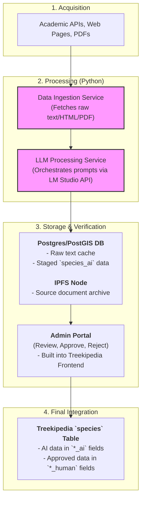

# Gemini Local AI Researcher Plan

This document provides a comprehensive technical plan for building a local deep researcher tool. The system is designed to augment the Treekipedia knowledge base by leveraging local Large Language Models (LLMs) to process, structure, and stage information from academic studies and web sources.

## 1. Introduction & Goals

The primary goal is to create a semi-automated pipeline that accelerates the research of tree species. The system will fetch data from diverse sources, use a local LLM to extract structured information according to the Treekipedia ontology, and stage this data for human verification through a dedicated admin interface.

**Core objectives:**
- **Automate Data Ingestion:** Systematically gather data from academic repositories (e.g., TreeSearch, CABI) and ethical web scraping.
- **Leverage Local LLMs:** Use a local LLM environment (like LM Studio) for data extraction to ensure privacy, control, and cost-effectiveness.
- **Ontological Alignment:** Structure the extracted data to fit the existing Treekipedia PostgreSQL schema, specifically populating the `_ai` designated fields.
- **Ensure Provenance:** Store source materials on IPFS and link them to the database entries for data traceability and verification, adhering to FAIR principles.
- **Human-in-the-Loop:** Develop a simple admin/curation portal for experts to validate AI-generated data, promoting it to human-verified status.
- **Scalable Architecture:** Build a modular system in Python that can handle batch processing of thousands of species over time.

## 2. System Architecture

The proposed architecture consists of five main components that work in a sequential pipeline, from data acquisition to final integration into the Treekipedia database.



### Component Roles:

1.  **Data Sources**: A curated list of academic databases (APIs) and websites that serve as the primary source of information for the research process.
2.  **Data Ingestion Service (Python)**: A set of scripts responsible for fetching data for a given tree species. It will prioritize APIs and fall back to ethical web scraping, handling raw data (HTML, PDF, JSON) and caching it.
3.  **LLM Processing Service (Python)**: The core orchestration engine. It takes the raw data, chunks it, and uses a series of structured prompts to ask the local LLM (via LM Studio's API) to extract specific information for each `_ai` field in the `species` table.
4.  **Staging & Storage (Postgres/PostGIS & IPFS)**:
    *   **Postgres/PostGIS**: The existing Treekipedia database will be used directly. The AI-extracted data will be inserted into the `_ai` columns of the `species` table, effectively acting as the "staging area".
    *   **IPFS**: The source documents (e.g., the PDF of a paper, a snapshot of a webpage) will be pinned to IPFS. The resulting Content Identifier (CID) will be stored in the `species.ipfs_cid` field to ensure provenance.
5.  **Curation & Admin Portal (Next.js)**: A new section within the existing Treekipedia frontend application. This interface will display the data from the `_ai` fields alongside the original source (retrieved via the IPFS CID). A curator can then compare, validate, and approve the data, which triggers a backend process to populate the corresponding `_human` fields.

## 3. Detailed Implementation Plan

### 3.1. Local LLM Environment Setup

1.  **Install LM Studio**: Download and install from [lmstudio.ai](https://lmstudio.ai/).
2.  **Model Selection**: Download a quantized version of a small, capable model. Based on the research in `research.md`, the recommended starting model is **`Phi-3-mini-4k-instruct-q4`** due to its strong performance in structured data extraction and low resource requirements.
3.  **Run Local Server**: In LM Studio, load the model and start the local server on `http://localhost:1234/v1`. This provides an OpenAI-compatible API endpoint for the Python scripts to interact with.

### 3.2. Data Ingestion & Processing (Python Project)

This will be a new standalone Python project.

**Project Structure:**

```
local-researcher/
|-- main.py             # Main orchestration script
|-- config.py           # DB credentials, API keys, target species list
|-- requirements.txt      # Python dependencies
|-- /fetchers           # Modules for data acquisition
|   |-- academic_apis.py
|   |-- web_scraper.py
|-- /processing
|   |-- llm_handler.py    # Interfaces with LM Studio API
|   |-- prompt_manager.py # Manages and templates the prompts
|-- /storage
|   |-- db_handler.py     # Handles connection and writing to Postgres
|   |-- ipfs_handler.py   # Handles pinning files to IPFS
```

**Key Implementation Steps:**

1.  **`main.py` Orchestrator**:
    *   Reads a list of species to research from `config.py` (or queries the DB for species with `researched = FALSE`).
    *   For each species, it calls the fetchers to gather raw data.
    *   It pins the collected source data to IPFS using `ipfs_handler.py` to get a CID.
    *   It iterates through a list of "aspects" (e.g., `elevation_ranges`, `compatible_soil_types`) defined in `prompt_manager.py`.
    *   For each aspect, it calls `llm_handler.py` with the appropriate prompt and raw data.
    *   It collects all the structured JSON outputs from the LLM.
    *   Finally, it calls `db_handler.py` to update the corresponding `species` row with all the extracted `_ai` data and the IPFS CID.

2.  **`prompt_manager.py`**: This module is crucial for quality. It will contain a dictionary of prompt templates, one for each piece of information needed.

    *Example Prompt Template for `compatible_soil_types`:*
    ```python
    PROMPTS = {
        "compatible_soil_types": """
        Based on the provided text, identify the compatible soil types for the species '{species_name}'.
        Text: "{text_chunk}"

        Respond ONLY with a JSON object in the following format:
        {{
            "soil_types": ["type1", "type2", "type3"]
        }}
        If no information is found, return an empty list.
        """
    }
    ```

3.  **Database Handler (`db_handler.py`)**:
    *   Use the `psycopg2` library to connect to the Treekipedia PostgreSQL database.
    *   Implement a function `update_species_ai_data(taxon_id, ai_data, ipfs_cid)` that constructs and executes an `UPDATE` SQL statement to populate the `_ai` fields for a given `taxon_id`.

### 3.3. Staging & Curation Portal (Frontend)

This will be a new set of pages within the existing `treekipedia/frontend` Next.js application, likely under an `/admin` route.

**Backend API (in `treekipedia/backend`):**

1.  **New Endpoints Needed**:
    *   `GET /api/species/unverified`: Fetches all species where at least one `_ai` field is populated but the corresponding `_human` field is null.
    *   `POST /api/species/verify`: An endpoint that accepts a `taxon_id` and a list of fields to verify. The handler for this endpoint will execute a SQL transaction that copies the data from `field_ai` to `field_human` for the approved fields.

**Frontend Components (in `treekipedia/frontend`):**

1.  **Curation Dashboard (`/admin/curation`)**: A table listing all species with pending AI-generated data, fetched from the `/api/species/unverified` endpoint.
2.  **Verification View (`/admin/curation/[taxon_id]`)**:
    *   Displays a side-by-side comparison of `_ai` and `_human` data for a single species.
    *   Provides a viewer for the source document, retrieved from IPFS using the stored CID (e.g., linking to `https://ipfs.io/ipfs/{cid}`).
    *   Includes "Approve" buttons next to each `_ai` field. Clicking "Approve" calls the `/api/species/verify` endpoint to promote that specific piece of data.

## 4. Development Roadmap

### Milestone 1: Core Pipeline Setup (1-2 days)

1.  Set up the `local-researcher` Python project structure.
2.  Install and configure LM Studio with the Phi-3 Mini model.
3.  Implement the `llm_handler.py` to successfully send a request and parse a response from the LM Studio server.
4.  Implement a basic `main.py` that can process a *single hardcoded species* and a *single aspect* (e.g., soil types), printing the result to the console.
5.  Fetch data from a single, simple source (e.g., a Wikipedia page).

### Milestone 2: Database and IPFS Integration (2-3 days)

1.  Implement `db_handler.py` to connect to Postgres and update a species record.
2.  Implement `ipfs_handler.py` to pin a file to a local or remote IPFS node (e.g., using `web3.storage` client for simplicity).
3.  Extend `main.py` to save the LLM output to the `species` table's `_ai` columns and the source CID to the `ipfs_cid` column.
4.  Expand the `prompt_manager.py` to include prompts for at least 5-10 different ecological aspects.

### Milestone 3: Admin & Curation UI (3-4 days)

1.  Build the required backend API endpoints in the Node.js backend (`/api/species/unverified`, `/api/species/verify`).
2.  Create the new admin pages in the Next.js frontend.
3.  Implement the dashboard to view unverified species.
4.  Implement the detailed verification view with the data comparison and IPFS source link.
5.  Connect the "Approve" buttons to the backend API to move data from `_ai` to `_human` fields.

### Milestone 4: Scaling and Automation (Ongoing)

1.  Implement batch processing in `main.py` to loop through all unresearched species.
2.  Add more data sources to the `fetchers`, including academic APIs.
3.  Refine prompts for better accuracy and error handling for malformed JSON.
4.  Add robust logging and error recovery to the Python script for long-running jobs.
5.  Explore Apache AGE by installing the extension in Postgres and testing basic Cypher queries on the species data to leverage its graph capabilities for future analytical features.

## 5. Appendix: Recommended Tooling

- **Python Libraries**:
  - `openai`: To interact with the LM Studio API.
  - `requests`: For API calls and web scraping.
  - `beautifulsoup4`: For parsing HTML.
  - `psycopg2-binary`: For connecting to PostgreSQL.
  - `python-dotenv`: For managing environment variables.
- **IPFS**:
  - A local IPFS Desktop node or a pinning service like `web3.storage` / `pinata` for ease of use.
- **Database**:
  - Existing PostgreSQL with PostGIS.
  - [Apache AGE](https://age.apache.org/) extension for graph queries.
