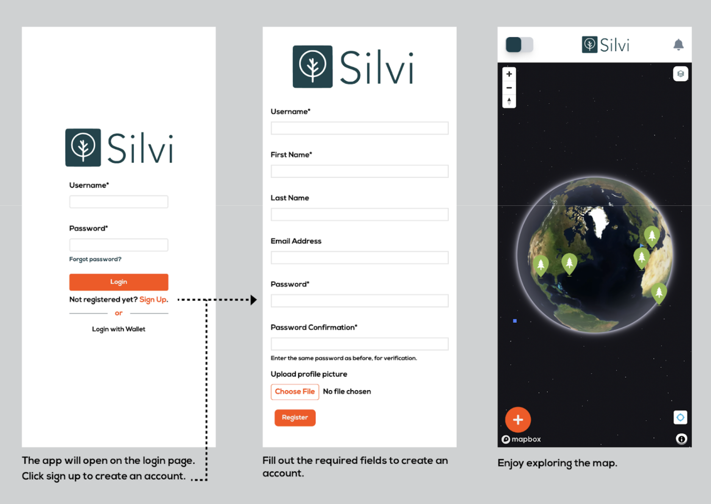

# Getting Started

## What is the Silvi App?&#x20;

[Silvi](https://app.silvi.earth/) is a Monitoring, Reporting, and Verification (MRV) Tool for Reforestation Projects around the world. **We built this app to help reforestation agents earn more for their work and motivate others to join the movement.**

### Why it matters:

As a tool, Silvi’s MRV technology ensures the tracking of tree growth, health, and the success of reforestation efforts, providing valuable data for local and global environmental initiatives. In turn, this data can provide inspiration for citizens interested in reforestation, making it easier for them to get involved and get rewarded for their efforts.&#x20;

### With the Silvi App you can...

* Register [Trees](registering-a-tree.md) or [Seedbeds](registering-a-seedbed.md) and[ Potted Beds](registering-a-potted-bed.md) at Nursery Sites
* [Log claims](logging-claims.md) (take images and upload forms about trees)
* [Connect a web3 wallet](connecting-a-wallet.md) to receive funds for completed claims
* View & share a map with [history of claims](claim-history-and-payouts.md) and associated data

## Joining the Silvi Initiative

In the open beta stage, we are still manually vetting and setting up payable projects with Silvi. Please reach out through our website, email, or socials, to set up a meeting with a Silvi team member.

### The Onboarding Process 

When a project is onboarded to Silvi, an administrative team member will set up a ‘methodology’ for your project. Think of methodologies as contracts, which promise a certain amount of payout in exchange for services or goods provided.

Through the Silvi app, users are responsible for registering and monitoring assets such as [trees](http://localhost:3000/Silvi-docs/docs/User%20Guide/Registering%20a%20Tree), [seedbeds](http://localhost:3000/Silvi-docs/docs/User%20Guide/Registering%20a%20Seedbed), or [potted beds](http://localhost:3000/Silvi-docs/docs/User%20Guide/Registering%20a%20Potted%20Bed), and [logging claims](http://localhost:3000/Silvi-docs/docs/User%20Guide/Logging%20Claims) on said assets to fulfill the requirements outlined in the methodology (contract), and receive the agreed-upon compensation.

Once users have logged claims, they will be able to view the status of the claim in claim history. In claim history users may also view the amount of total funds that have been paid, through Silvi.

As a user, your projects and assets registered will be publicly viewable on the home map page, so Silvi users around the world can see the tangible impact you have made in reforestation, and the steps you took to get there.

\

## Registration

How to register an account on the app.

1. The app will open on the login page. Click sign up to create an account.
2. Fill out the required fields to create an account.
3. Enjoy exploring the map.

<figure><figcaption></figcaption></figure>
